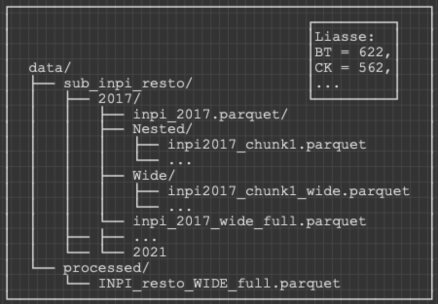
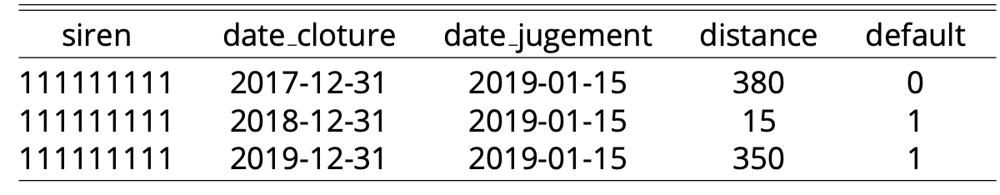
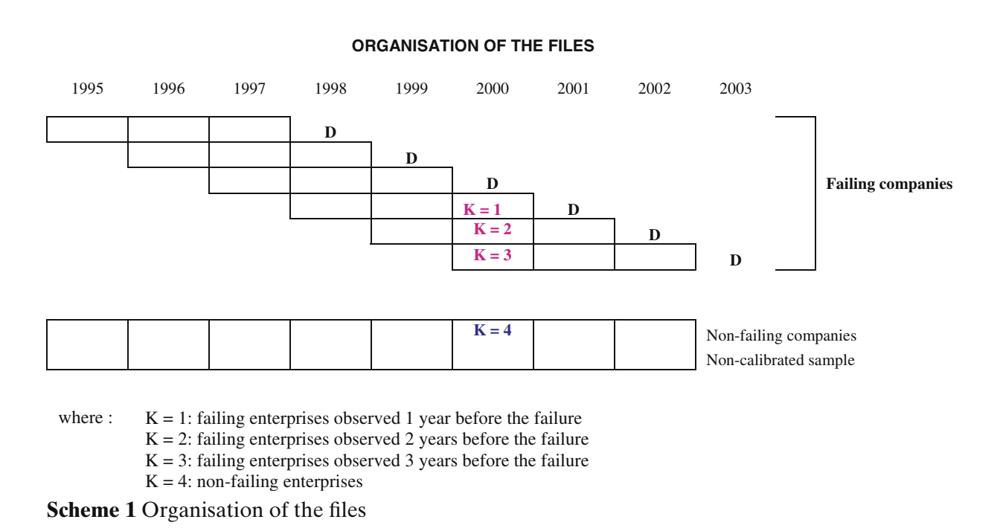

# Initialisation

```{r}
#| include: false
library(tidyverse)
library(lubridate)
library(httr)
library(xml2)
library(archive)
library(purrr)
library(janitor)
library(stringr)
library(furrr)
library(curl)
library(stargazer)
library(arrow)
library(data.table)

rm(list = ls())

```

# Part 0 : Bodacc data obtention

This part focus on collecting the data from the Bodacc website: <https://echanges.dila.gouv.fr/OPENDATA/BODACC/FluxHistorique/>

## Options

```{r}
#| include: false
options(timeout = 1200)
## Parallel plan (safe for BODACC servers)
plan(multisession, workers = 6)
```

## Parameters

```{r}
years <- 2017:2021

base_root <- "https://echanges.dila.gouv.fr/OPENDATA/BODACC/FluxHistorique"
dest_root <- "data/raw/BODACC_TAZ"

#To ensure folders exist for other users of this code

dir.create("data", recursive = TRUE, showWarnings = FALSE)
dir.create("data/raw", recursive = TRUE, showWarnings = FALSE)
dir.create(dest_root, recursive = TRUE, showWarnings = FALSE)
```

## XML extraction logic

Here we follow the XML extraction procedure put on the google drive.

```{r}
extract_annonce <- function(a) {
  
  pm    <- xml_find_first(a, "personneMorale")
  immat <- xml_find_first(a, "numeroImmatriculation")
  
  tibble(
    nojo             = xml_text(xml_find_first(a, "nojo")),
    tribunal         = xml_text(xml_find_first(a, "tribunal")),
    denomination     = xml_text(xml_find_first(pm, "denomination")),
    forme_juridique  = xml_text(xml_find_first(pm, "formeJuridique")),
    numero_rcs       = xml_text(xml_find_first(immat, "numeroIdentificationRCS")),
    activite         = xml_text(xml_find_first(a, "activite")),
    famille_jugement = xml_text(xml_find_first(a, "jugement/famille")),
    nature_jugement  = xml_text(xml_find_first(a, "jugement/nature")),
    date_jugement    = xml_text(xml_find_first(a, "jugement/date")),
    type_annonce     = xml_name(xml_find_first(a, "typeAnnonce/*"))
  )
}
```

## Downloading

Here is how we downloaded the files if necessary. However, as it can take time, we turn it off and directly include the necessary files in the .zip of the project.

```{r}
#| message: true
#| warning: true

#download_bodacc_year <- function(year) {
  
#  base_url <- paste0(base_root, "/", year, "/")
#  dest_dir <- file.path(dest_root, year)
  
#  dir.create(dest_dir, recursive = TRUE, showWarnings = FALSE)
  
#  message("Scanning year ", year)
#  page <- readLines(base_url, warn = FALSE)
  
#  pattern <- paste0("PCL_BXA", year, "[0-9]{4}\\.taz")
#  files <- str_extract_all(page, pattern) |> unlist() |> unique()
  
#  download_plan <- tibble(
#    file = files,
#    url  = paste0(base_url, files),
#    dest = file.path(dest_dir, files)
#  ) |>
#    filter(!file.exists(dest))
  
#  message("  → ", nrow(download_plan), " files to download")
  
#  if (nrow(download_plan) == 0) return(invisible())
  
#  future_walk2(
#    download_plan$url,
#    download_plan$dest,
#    ~ try(
#      curl_download(.x, .y, quiet = TRUE),
#      silent = TRUE
#    )
#  )
  
#  invisible()
#}

#walk(years, download_bodacc_year)
```

## Parsing

Then we parse all the XML files to obtain a first dataframe.

```{r}
parse_bodacc_year <- function(year) {
  
  taz_dir <- file.path(dest_root, year)
  taz_files <- list.files(taz_dir, "\\.taz$", full.names = TRUE)
  
  message("Parsing year ", year, " (", length(taz_files), " files)")
  
  future_map_dfr(
    taz_files,
    function(path) {
      xml_raw  <- archive_read(path)
      doc      <- read_xml(xml_raw)
      annonces <- xml_find_all(doc, ".//annonce")
      
      map_dfr(annonces, extract_annonce)
    },
    .progress = TRUE
  ) |>
    mutate(year = year)
}

bodacc_all_years <- map_dfr(years, parse_bodacc_year) %>% 
  clean_names() %>% 
  mutate(across(everything(), trimws))

bodacc_all_years <- bodacc_all_years %>% 
  dplyr::select(numero_rcs, date_jugement, nature_jugement)
```

## Jugement/Default selection

We follow the Banque de France methodology and classify as default the following jugement: "Jugement d'ouverture d'une procédure de redressement judiciaire", "Jugement d'ouverture de liquidation judiciaire", "Jugement d'ouverture d'une procédure de sauvegarde", "Autre jugement d'ouverture".

We keep only the default observations (non-default available on INPI dataframe).

We first create a new folder to store the different dataframe:

```{r}
dir.create("data/processed", recursive = TRUE, showWarnings = FALSE)
```

```{r}
default_event <- c(
  "Jugement d'ouverture d'une procédure de redressement judiciaire",
  "Jugement d'ouverture de liquidation judiciaire",
  "Jugement d'ouverture d'une procédure de sauvegarde",
  "Autre jugement d'ouverture"
)

bodacc_defaults <- bodacc_all_years %>% 
  filter(nature_jugement %in% default_event)%>% 
  filter(!is.na(date_jugement)) %>% 
  filter(!is.na(numero_rcs))

write_csv(bodacc_defaults, "data/processed/bodacc_defaults.csv")
```

## Merge with NAF

We then merge with the NAF dataset for subsequent sector filtering. To make possible the merging with the NAF dataset, in the BODACC dataframe we have to rewrite the numero_rcs from the format XXX XXX XXX to XXXXXXXXX, rename it in "siren" and put leading 0 if there is less than 9 digits.

```{r}
#We first rewrite the siren in bodacc file so it matches the format in the NAF file

f <- "data/processed/bodacc_defaults.csv"

# Read only numero_rcs
dt <- fread(f, select = c("numero_rcs"))

# Clean SIREN: remove non-digit characters
dt[, siren := gsub("[^0-9]", "", numero_rcs)]

# Remove rows that became empty after removing non-digits
dt <- dt[siren != ""]

# Convert to numeric and pad to 9 digits
dt[, siren := sprintf("%09d", as.numeric(siren))]

# Keep only unique mappings
dt_unique <- unique(dt, by = "numero_rcs")

# Merge with Bodacc

bodacc_full <-  fread(f)
bodacc_full <- bodacc_full[!is.na(numero_rcs) & numero_rcs != "" & numero_rcs != "000 000 000"]

bodacc_full <- merge(
  bodacc_full,
  dt_unique[, .(numero_rcs, siren)],
  by = "numero_rcs",
  all.x = TRUE
) %>% dplyr::select(siren, date_jugement, nature_jugement)

bodacc_full <- write_csv(bodacc_full, "data/processed/bodacc_full.csv")
```

After having our bodacc with clean siren naming, we can merge:

We first downloaded the NAF-Siren dataset from: <https://www.data.gouv.fr/datasets/base-sirene-des-entreprises-et-de-leurs-etablissements-siren-siret/>

This is the file named "StockUniteLegale_utf8.csv".

```{r}
#| message: false
#| warning: false

#Load NAF dataset
NAF <- open_dataset("data/StockUniteLegale_utf8.csv", format = "csv")
naf <- NAF %>%
  head(3) %>%
  collect() %>% glimpse()
NAF <- NAF %>% dplyr::select(siren, activitePrincipaleUniteLegale)

#MERGING
#1: We first ensure that siren in both datasets have the same format
#(character, 9 digits with leading zeros if needed)

bodacc_full <- open_dataset(
  "data/processed/bodacc_full.csv",
  format = "csv"
) %>%
  mutate(
    siren = as.character(siren),
    siren = str_pad(siren, 9, pad = "0")
  )

NAF <- open_dataset(
  "data/StockUniteLegale_utf8.csv",
  format = "csv"
) %>%
  dplyr::select(siren, activitePrincipaleUniteLegale) %>%
  mutate(
    siren = as.character(siren),
    siren = str_pad(siren, 9, pad = "0")
  ) %>% rename(NAF = activitePrincipaleUniteLegale)

write_parquet(NAF, "data/processed/NAF_siren.parquet")

bodacc_naf <- bodacc_full %>%
  inner_join(NAF, by = "siren")
  
sample <- bodacc_naf %>%
  head(100) %>%
  collect()

write_parquet(bodacc_naf, "data/processed/bodacc_naf.parquet")
```

Now we have our dataframe with all the defaulting companies and their NAF code.

# Part 1 : Full dataframe (unnested) + Create default variable

## Justification of the sector selection

This scoring project focuses on specific sector : the hotel and restaurant sector. We identify relevant economic literature addressing corporate default in this sector, with particular attention to the period of the COVID-19 pandemic*.* @rahmah2021_covid_financial_distress have found that the COVID-19 crisis had negative impact on the overall economy on Indonesia. Using the Altman Z-Score model, the authors show that the hotel, tourism, and restaurant sectors were among the most severely affected in terms of financial distress. To place our analysis in a French institutional context, which is more consistent with our data, @bureau2021_hebergement_restauration_covid document that the accommodation and food services sector was also one of the most affected sectors in France during the COVID-19 crisis. Due to strict health restrictions and repeated lockdowns, sectoral activity experienced dramatic declines, with an estimated drop of 71% between March and May 2020 and 63% during November–December 2020.

This large drop in the Hotels and Restaurants sector lead to a large decrease of its cash-flows, and needed government support to deal with the crisis. Indeed, the sector of Hotels and Restaurants made the most use of the French public measures. The public support used by this sector represents 37% of the cumulative amounts of payments from the solidarity fund, and 8% of the state-guarantee-loans ( PGE) and 7% of deferred social security.

Therefore, given both the economic shocks and the financial support provided by the French government to the hotel and restaurant sector, it is particularly relevant to focus the default analysis on this sector over the period 2017–2021, including the specific pandemic crisis.

## Preparation of the dataset

At the moment we have the following dataframe which we want to add to the INPI one in order to create our default variable.

```{r}
rm(list = ls())
BODACC_NAF <- read_parquet("data/processed/bodacc_naf.parquet", format = "parquet")
sample_bodaccNAF <- BODACC_NAF %>% head()
stargazer(sample_bodaccNAF, summary = F, type = "text")
```

On this dataframe, we kept only the observations that can be classified as a default, following Banque de France methodology : (nature_jugement = "Jugement d'ouverture d'une procédure de redressement judiciaire", "Jugement d'ouverture de liquidation judiciaire", "Jugement d'ouverture d'une procédure de sauvegarde", "Autre jugement d'ouverture" ).

### Unnest the INPI

Before merging, we need to unnest the INPI data set.

First we downloaded the inpi dataset from: <https://www.data.gouv.fr/datasets/donnees-financieres-detaillees-des-entreprises-format-parquet>

This is the file: export-detail-bilan.parquet

Before unnesting, we join the INPI with NAF in order to keep only our sector of interest and therefore use less memory/time.

```{r}
BODACC_DEFAULT <- read_parquet("data/processed/bodacc_naf.parquet")
NAF_hotel_resto <- c("55.10Z","55.20Z","55.30Z","55.90Z","56.10A","56.10B","56.10C","56.21Z","56.29A","56.29B","56.30Z")
BODACC_DEFAULT_RESTO <- BODACC_DEFAULT %>% filter(NAF %in% NAF_hotel_resto)

#Get Inpi_resto
ds_inpi <- open_dataset("data/raw/export-detail-bilan.parquet") %>%
  filter(
    confidentiality == "Public",
    date_cloture_exercice >= as.Date("2017-01-01"),
    date_cloture_exercice <= as.Date("2021-12-31")
  ) %>%
  dplyr::select(siren, date_cloture_exercice, liasse)

INPI <- ds_inpi %>% collect()

naf_open <- open_dataset("data/processed/NAF_siren.parquet")
df_NAF <- naf_open %>% collect()

INPI_NAF <- INPI %>%
  left_join(df_NAF, by = "siren")

INPI_resto <- INPI_NAF %>% filter(NAF %in% NAF_hotel_resto) %>% dplyr::select(-NAF)

write_parquet(INPI_resto, "data/processed/INPI_resto.parquet")
```

The data from INPI is in a parquet (nested) format. The processus to unnest it is very memory demanding. Hence, we split the data in smaller chunks. It follows this structure:



```{r}
#| message: true
#| warning: false

################################################################################
################################################################################
############################# WIDENED INPI_RESTO ###############################
################################################################################
################################################################################

INPI_resto <- read_parquet("data/processed/INPI_resto.parquet")

#We first split the dataframe by year
years <- 2017:2021

for (yr in years) {
  message("Processing year ", yr)
  
  # Filter by year
  ds_year <- INPI_resto %>%
    filter(year(date_cloture_exercice) == yr)
  
  # Create year folder
  year_path <- paste0("data/sub_inpi_resto/", yr)
  dir.create(year_path, recursive = TRUE, showWarnings = FALSE)
  
  # Save unchunked Arrow dataset
  write_dataset(ds_year, path = paste0(year_path, "/inpi_", yr, ".parquet"), format = "parquet")
  message("Saved raw dataset for year ", yr)
}

for (yr in years) {
  file_path <- paste0("data/sub_inpi_resto/", yr, "/inpi_", yr, ".parquet/part-0.parquet")
  assign(paste0("inpi_", yr), open_dataset(file_path) %>% collect())
}

#We then split by chunk, create the nested and wide subfolders to store the results
#Here we just select the potential variables that can be used to create financial indicators and ratios for the subsequent analysis.
key_wanted <- c(
  "FL","FM","FN","FO","FS","FT","FU","FV","FW","FX","FY","FZ",
  "HP","HQ","GW","FP","GA","GB","GC","GD","GM","GQ","HA","HE",
  "HJ","HK","CJ","CK","CF","CG","CD","CE","DW","DX","DY","DZ",
  "EA","EB","FJ","BJ","BK","DS","DT","DU","DV","EH","DL","AA",
  "DO","FC","GG","HN","YP","GF","GP","GU","CO","1A","EE","BL",
  "BN","BP","BR","BT","BM","BO","BQ","BS","BU","BX","BY"
)

chunk_size <- 5000

for (yr in years) {
  
  cat("Processing year", yr, ": (nested chunks to wide chunks)\n")
  
  df <- get(paste0("inpi_", yr))
  n <- nrow(df)
  n_chunks <- ceiling(n / chunk_size)
  
  # Create directories for chunks
  dir.create(paste0("data/sub_inpi_resto/", yr, "/Nested"), recursive = TRUE, showWarnings = FALSE)
  dir.create(paste0("data/sub_inpi_resto/", yr, "/Wide"), recursive = TRUE, showWarnings = FALSE)
  
  # Split into nested chunks
  for (i in seq_len(n_chunks)) {
    start_row <- (i - 1) * chunk_size + 1
    end_row <- min(i * chunk_size, n)
    
    chunk <- df[start_row:end_row, ]
    
    chunk_path <- paste0("data/sub_inpi_resto/", yr, "/Nested/inpi", yr, "_chunk", i, ".parquet")
    write_parquet(chunk, chunk_path)
  }
  
  # Process each chunk into wide format
  for (i in seq_len(n_chunks)) {
    chunk_path <- paste0("data/sub_inpi_resto/", yr, "/Nested/inpi", yr, "_chunk", i, ".parquet")
    inpi_chunk <- read_parquet(chunk_path)
    
    inpi_chunk_unest <- inpi_chunk %>%
      unnest(liasse) %>%
      filter(key %in% key_wanted)
    
    inpi_chunk_wide <- inpi_chunk_unest %>%
      pivot_wider(
        id_cols = c(siren, date_cloture_exercice),
        names_from = key,
        values_from = value,
        values_fn = dplyr::first
      )
    
    wide_path <- paste0("data/sub_inpi_resto/", yr, "/Wide/inpi", yr, "_chunk", i, "_wide.parquet")
    write_parquet(inpi_chunk_wide, wide_path)
  }
  
  # Merge all wide chunks for the year
  wide_chunk_files <- list.files(
    paste0("data/sub_inpi_resto/", yr, "/Wide"),
    pattern = "_wide.parquet$",
    full.names = TRUE
  )
  
  wide_chunks_list <- lapply(wide_chunk_files, read_parquet)
  inpi_wide_full <- bind_rows(wide_chunks_list)
  
  wide_full_path <- paste0("data/sub_inpi_resto/", yr, "/inpi_", yr, "_wide_full.parquet")
  write_parquet(inpi_wide_full, wide_full_path)
  assign(paste0("WIDE_", yr), read_parquet(wide_full_path))
  
  cat("For year", yr, ", all nested chunks have been put into wide format and row bind.\n\n")
}

#We merge everything 
WIDE_resto_full <- bind_rows(mget(paste0("WIDE_", years)))

# Save final dataset
dir.create("data/processed", recursive = TRUE, showWarnings = FALSE)
write_parquet(WIDE_resto_full, "data/processed/INPI_resto_WIDE_full.parquet")
cat("INPI data set in wide format saved.\n")

```

Now, we get the INPI dataframe in the wide format. It looks like this (We display only the first financial variables here):

```{r}
Head_df_wide <- WIDE_resto_full %>% 
  mutate(date_cloture_exercice = as.character(date_cloture_exercice)) %>% 
  head(5)
  
stargazer(Head_df_wide[,1:5], summary = F, type = "text", rownames = F, title = "INPI in wide format (Accomodation and Restauration sector)")
```

Once we have this data frame, we create our default variable following the methodology of @bardos2007stake. Basically, for firms that default, we associate the default at the "date_cloture_exercice" the closest to its first "date_jugement". This assume no resurrection for defaulting firms.

Here you can have a visual of how we associate default to the closest date_cloture_exercice:



And here you have the visual for how we keep all observation for non-defaulting companies, and we only keep the observation up to first default for the defaulting companies:



```{r}
#| warning: false

WIDE_resto_full <- read_parquet("data/processed/INPI_resto_WIDE_full.parquet")
inpi_ext_resto <- WIDE_resto_full %>% 
  left_join(
    BODACC_DEFAULT_RESTO %>% 
      dplyr::select(siren, date_jugement, nature_jugement),
    by = "siren"
  ) %>%
  mutate(
    days_diff = abs(as.integer(
      difftime(date_cloture_exercice, date_jugement, units = "days")
    ))
  )

closest <- inpi_ext_resto %>%
  filter(!is.na(date_jugement)) %>%
  group_by(siren) %>%
  filter(days_diff == min(days_diff, na.rm = TRUE)) %>%
  slice_max(date_cloture_exercice, n = 1, with_ties = FALSE) %>%
  ungroup() %>%
  dplyr::select(
    siren,
    date_cloture_exercice_closest = date_cloture_exercice
  )
inpi_ext_resto <- inpi_ext_resto %>%
  left_join(closest, by = "siren") %>%
  mutate(
    default_event = if_else(
      !is.na(date_cloture_exercice_closest) &
        date_cloture_exercice == date_cloture_exercice_closest,
      1L, 0L
    )
  ) %>%
  filter(
    #For firms without default we keep all observations
    is.na(date_cloture_exercice_closest) |
      #For firms with default, we keep observations up to default
      date_cloture_exercice <= date_cloture_exercice_closest
  ) %>%
  dplyr::select(-days_diff, -date_cloture_exercice_closest)

write_parquet(inpi_ext_resto, "data/processed/FINAL_DATABASE.parquet")

DATAFRAME_overview <- inpi_ext_resto %>% 
  head(5) %>% 
  dplyr::select(siren, date_cloture_exercice, default_event, FL, EE) %>%
  mutate(date_cloture_exercice = as.character(date_cloture_exercice))

stargazer(DATAFRAME_overview, type = "text", summary = FALSE)
```

As a result, we obtain this data set. We save it as "FINAL_DATABASE.parquet". On the next report, we will treat missing values, create our ratios, conduct our exploratory data analysis and our prediction models analysis.

# References
